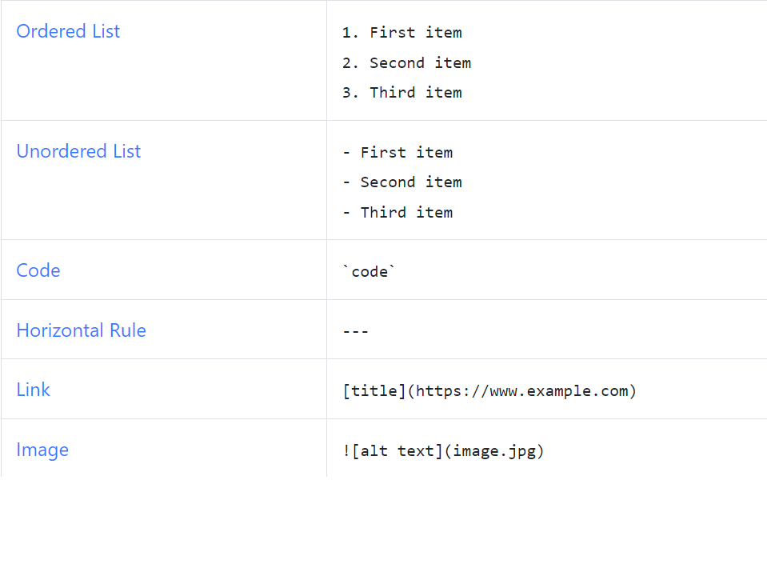

# Markdown Resources

- [Basic Syntax](https://www.markdownguide.org/basic-syntax)
- [Extended Syntax](https://www.markdownguide.org/extended-syntax/#heading-ids)
- [安裝PicGo+GitHub快速解決圖檔問題, 直接按下ctrl+alt+u就可上傳圖檔至GitHub並生成圖檔連結](https://tw511.com/a/01/45759.html)

---


[Microsoft](https://www.microsoft.com)


## Chapter 1 {#chapter1-id}

- 測試一
- 測試二
- 測試三
  - demo 1
  - demo 2
- 測試四

- [X] list1
- [ ] list2
- [ ] list3
- [ ] 

refer to [code](#chapter1-id)
This is a paragraph

This is another paragraph 
Do you know that?

That is so funny! :joy: Gone camping! ⛺ Be back soon.

😖 :confounded:

First term
: this is the definition of first term

Second term
: this is 2nd term
another term

~~the world is fat~~
to highligh ==very import words==


## Chapter 2
* 測試一
* 測試二
* 測試三
  * 測試1.1
  * 測試1.2


| 姓名       | 年齡 | 電話       |
| ---------- | ---: | ---------- |
| Daniel     |   50 | 098509323  |
| Jona Huang |   43 | 0987434222 |


```json
{"name": "daniel",
"age": 50
}
```


**bold text**
*italic*
***very important***
A*cat*Miao
==test== H~2~O
X^2^

`a=3`
`https://www.ibm.com`
https://www.ibm.com


>這裡是註解
>>還有這裡
>>>還有呢
>>> &nbsp; 
>>  
>最後


```java
String a = "hello";
String b = a;
if (a.equals("hello")) {

}
```


1. demo
   1. aaa
   2. bbb
   3. ccc
   4. 
2. 
3. demo 2
4. demo 3

- demo 1
- demo 2
  - abc
  - def
    - hello
    - hello
    - 

+ 1998\.

  ```
    a=3;
    b=2;
  ```

  flag=true;
  b=2;


+ item2
+ item3

* item1
* item2
* item3
  


```Java
@SpringBootApplication
public class DemoApplication {

	public static void main(String[] args) {
		SpringApplication.run(DemoApplication.class, args);
	}

}
```
這是粗體 
**這是粗體 **

`String a = "hello";`
---

```
public static void main(Strings args) {

}
```



[IBM](https://www.ibm.com) |
[Microsoft](https://www.microsoft.com)

[Back to Chapter1](#chapter1-id)


